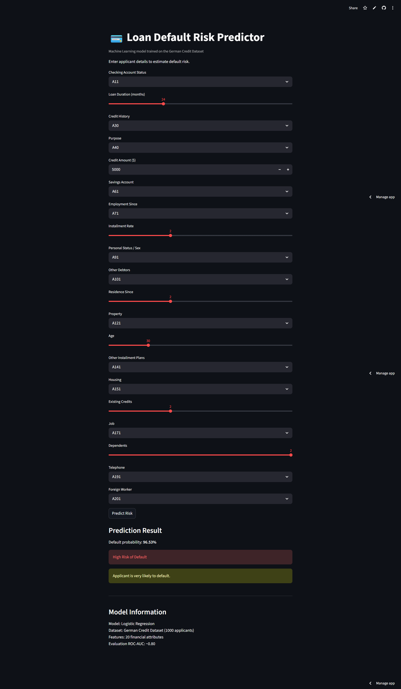

## Loan Default Risk Predictor

A machine learning web application that predicts the risk of loan default based on applicant financial information.
The model is trained on the German Credit Dataset and deployed as an interactive Streamlit web app.

## Live Demo

Try the application here:
https://loan-default-risk-predictor-project.streamlit.app

## Application Preview


## Project Overview

Financial institutions must evaluate whether a loan applicant is likely to default before approving credit.
This project builds a machine learning pipeline that analyzes applicant financial attributes and predicts the probability of default.

The application allows users to enter applicant information through a Streamlit interface and receive:

- Default probability
- Risk classification
- Risk interpretation

## Dataset

This project uses the **German Credit Dataset**, a well-known dataset for credit risk modeling.

### Dataset characteristics

| Property | Value |
|--------|------|
| Total applicants | 1000 |
| Features | 20 |
| Target variable | Credit risk |

## The dataset includes information such as:

- Checking account status
- Loan duration
- Credit amount
- Credit history
- Savings account status
- Employment duration
- Installment rate
- Age
- Housing type
- Number of existing credits
The target variable indicates whether an applicant is high risk or low risk for default.

## Machine Learning Pipeline

The project uses a Scikit-learn pipeline to combine preprocessing and modeling.

Data Preprocessing
Two types of features are handled:

Numerical Features

- Missing value imputation
- Standard scaling

Categorical Features

- Missing value imputation
- One-hot encoding

This ensures the model can properly process mixed data types.

## Models Evaluated

Two machine learning models were tested:

- Logistic Regression

- Random Forest Classifier

The deployed application uses Logistic Regression.

## Model Evaluation

The models were evaluated using:

- Accuracy
- Precision
- Recall
- F1 Score
- ROC-AUC

## Final performance:

| Metric | Score |
|--------|-------|
| ROC-AUC | ~0.80 |

## Application Features

The Streamlit application allows users to enter financial information including:

- Checking account status
- Loan duration
- Credit history
- Loan purpose
- Credit amount
- Savings account
- Employment duration
- Installment rate
- Personal status
- Other debtors
- Residence duration
- Property type
- Age
- Other installment plans
- Housing type
- Existing credits
- Job type
- Dependents
- Telephone status
- Foreign worker status

The application returns:

Probability of default
- High / Low risk classification
- Interpretation of risk level
- Tech Stack

## Programming Language
- Python
- Libraries
- Pandas
- NumPy
- Scikit-learn
- Streamlit
- Tools
- Jupyter Notebook
- Git
- GitHub
- Streamlit Cloud

## Project Structure

```
loan-default-risk-predictor
│
├── assets
│   └── loan-default-risk-predictor-project-streamlit-app.png
│
├── data
│   └── german.data
│
├── notebooks
│   └── loan_default_prediction.ipynb
│
├── streamlit_app.py
├── requirements.txt
├── runtime.txt
└── README.md
```

## Installation (Run Locally)

### Clone the repository

```bash
git clone https://github.com/princeyv/loan-default-risk-predictor.git
cd loan-default-risk-predictor
```

### Install dependencies

```bash
pip install -r requirements.txt
```

### Run the Streamlit application

```bash
streamlit run streamlit_app.py
```

Example Prediction Output

Example output from the model:

Default probability: 94.46%
High Risk of Default
Applicant is very likely to default.

## Future Improvements

Possible extensions of this project include:
Hyperparameter tuning
Feature importance visualization
Explainable AI (SHAP values)
Gradient Boosting / XGBoost models
Enhanced UI with visual analytics

## Author

Prince Kr. Yadav
Master’s Student – Data Science
University of North Texas

## License

This project is intended for educational and portfolio purposes.
